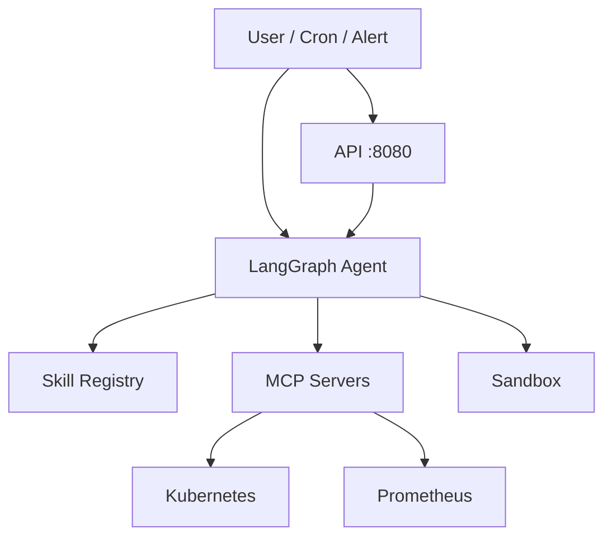

# Sentinel-X

**AI-native SRE Agent Platform**  
**云原生自愈 Agent 平台**

> MCP-standardized observability + micro-sandbox validation for Kubernetes operations.  
> 基于 MCP 协议与微沙箱的云原生自愈 Agent，实现智能运维闭环（**查 / 判 / 试 / 记 / 触**）。

---

## Features

| Capability | EN | 中文 |
|------------|-----|------|
| Observability | Kubernetes + Prometheus via MCP | K8s / Prom 可观测性 |
| Analysis | Rule-based RCA + optional LLM narrative | 根因分析 + 可选 LLM 叙事 |
| Skills | Markdown runbooks + SQLite FTS retrieval | Skill 框架与检索 |
| Integration | Model Context Protocol tool servers | MCP 标准化工具层 |
| Validation | Docker sandbox (namespace allowlist) | 沙箱预演修复 |
| Deploy | One-shot bash install on k3s | 一键部署 |
| Alert close | Cron patrol + API inspect trigger (W7) | 告警自动巡检与触发 |

---

## Architecture



**Detailed diagrams:** [docs/architecture/](docs/architecture/README.md) · **Decisions:** [docs/adr/](docs/adr/README.md) · **Internal review:** [ARCHITECTURE-REVIEW v3](docs/ARCHITECTURE-REVIEW.md)

---

## Roadmap

| Version | Theme | Status |
|---------|-------|--------|
| **v0.1** | Monitoring MVP — K8s MCP, sync, list_pods | Released |
| **v0.2** | Agent Runtime — LangGraph inspect pipeline | Released |
| **v0.3** | Prometheus MCP — metrics in graph | Released |
| **v0.4** | One-shot Deploy + W7 Alert Auto Close | **Current** |

Full changelog: [CHANGELOG.md](CHANGELOG.md) · Engineering weekly plan: [docs/ROADMAP.md](docs/ROADMAP.md)

---

## Demo

Screenshots and GIF — **coming soon** → [`docs/assets/demo/`](docs/assets/demo/)

**Live verify on server** (after [one-shot install](docs/deploy/DEPLOY-ONE-SHOT.md)):

```bash
sudo verify-sentinel-x.sh --full
sudo sentinel-inspect-patrol.sh
curl -s http://127.0.0.1:8080/health
```

Evidence: [2026-W25](docs/weekly/2026-W25.md) (install) · [2026-W26](docs/weekly/2026-W26.md) (patrol)

---

## Implementation status

| Area | Status | Location |
|------|--------|----------|
| K8s / Prom MCP | **Live** | `mcp-servers/` |
| LangGraph graph + sync/query | **Live** | `agents/langgraph-integration/`, `agents/langgraph-server/` |
| Deploy scripts + runbooks | **Live** | `deploy/`, `docs/deploy/DEPLOY-*.md` |
| P0 one-shot install (W1–W7) | **Live ✅** | `deploy/install/install-sentinel-x.sh`, [DEPLOY-ONE-SHOT.md](docs/deploy/DEPLOY-ONE-SHOT.md) |
| Streamlit UI (W4) | **Minimal live** | `apps/ui/` |
| Inspect / diagnose E2E | **Live (dry-run)** | `agents/langgraph-integration/scripts/demo/inspect_langgraph_live_demo.py` |
| Alert patrol + inspect trigger (W7) | **Live ✅** (cron patrol) | `src/trigger/`, `deploy/sync/sentinel-inspect-patrol.sh` |
| Prom metrics in graph (W3) | **Live** | `scripts/live/mcp_prom_sync_live.py`, `top_pods_by_cpu` |
| FastAPI `apps/api` (W7) | **Live optional** (`--with-api`; `/health` + `POST /v1/inspect` ✅) | `apps/api/` |
| Root `docker-compose.yml` | Planned | — |
| `skills/` storage + FTS retrieval (W5) | **Live** | `skills/`, `agents/langgraph-integration/src/skills/` |
| `sandbox/` pre-run (W6) | **Live** (Docker + namespace policy) | `sandbox/`, `src/sandbox/` |

详细周计划与进度：**[docs/ROADMAP.md](docs/ROADMAP.md)** · 架构评审 v3：**[docs/ARCHITECTURE-REVIEW.md](docs/ARCHITECTURE-REVIEW.md)** · 开发日志：**[docs/dev-log/](docs/dev-log/README.md)**

---

## Directory structure (actual)

```text
sentinel-x/
├── agents/
│   ├── langgraph-integration/   # Adapter, sync, query, MCP clients, agent logic
│   │   └── scripts/live|demo/   # Production sync vs dev demos
│   └── langgraph-server/        # LangGraph dev graph (ingest → … → query)
├── apps/
│   ├── api/                     # FastAPI inspect + Alertmanager webhook (W7)
│   └── ui/                      # Streamlit minimal UI (W4)
├── mcp-servers/                 # k8s/, prometheus/, compose/, images/
├── skills/                      # Markdown skills + SQLite FTS index (W5)
├── sandbox/                     # Docker kubectl executor + audit (W6)
├── deploy/                      # install/, config/, sync/, systemd/, prometheus/, verify/
├── docs/                        # ROADMAP, adr/, architecture/, dev-log/, deploy/, weekly/
└── dist/                        # Offline helm bundles (kube-prometheus)
```

**Planned (not in repo yet):** root `docker-compose.yml`, top-level `configs/clusters.yaml` (live).

---

## Quick start — production server

**New server (P0):** one-command install → **[docs/deploy/DEPLOY-ONE-SHOT.md](docs/deploy/DEPLOY-ONE-SHOT.md)** (`sudo bash deploy/install/install-sentinel-x.sh`).

Step-by-step index → **[docs/deploy/DEPLOY-SERVER.md](docs/deploy/DEPLOY-SERVER.md)**

Ordered setup: k3s → MCP kubeconfig → LangGraph systemd → K8s cron sync → (optional) Prom → UI → API.

**Live defaults** (production server):

```text
cluster_id   = k3s-prod
namespace    = kube-system
thread_id    = 5ad00ee0-6f4d-5cd6-a021-99469a86e4e1
LANGGRAPH    = http://127.0.0.1:2024
```

---

## Quick start — local dev (UI + LangGraph)

```bash
git clone <repo> && cd sentinel-x
python -m venv .venv && source .venv/bin/activate
pip install -U "langgraph-cli[inmem]"
pip install -r agents/langgraph-server/requirements.txt
pip install -r agents/langgraph-integration/requirements.txt
pip install -r apps/ui/requirements.txt

# Terminal 1: LangGraph
cd agents/langgraph-server && langgraph dev --host 127.0.0.1 --port 2024 --no-browser

# Terminal 2: sync mock or point at server thread via SSH tunnel, then UI
export LANGGRAPH_RUN_LIVE=1
export LANGGRAPH_API_URL=http://127.0.0.1:2024
streamlit run apps/ui/app.py
```

Integration tests: `python -m unittest discover -s agents/langgraph-integration/tests -v`  
Graph smoke tests: `python -m pytest agents/langgraph-server/tests/ -v`  
API tests: `python -m unittest discover -s apps/api/tests -v`

See also [agents/langgraph-integration/README.md](agents/langgraph-integration/README.md).

---

## Features (target vs current)

| Capability | Current |
|------------|---------|
| MCP query (Pod, Event, CPU/memory) | Live via LangGraph thread |
| Rule-based diagnose + narrative | Live inspect (template; LLM optional) |
| Simulated execute (restart_pod, etc.) | Dry-run only |
| Sandbox pre-run | Live (`sentinel-sandbox` ns only) |
| Skills retrieval | Live (SQLite FTS5) |
| Streamlit dashboard | Minimal (pods / top CPU / inspect) |

---

## Skill template (W5)

General knowledge in frontmatter; cluster/namespace/pod only in **Evidence** body. See [`skills/TEMPLATE.md`](skills/TEMPLATE.md).

```markdown
---
name: fix-crashloop-restart
version: 1.0
fingerprint: <sha256 sorted issues|actions>
tags: [k8s, CrashLoop]
symptom: CrashLoopBackOff
issues: [CrashLoop]
recommended_actions: [restart_pod]
risk_level: critical
verified: false
hit_count: 1
source_count: 1
---

# Problem
Pod enters CrashLoopBackOff with container restart loop.

# Resolution
1. Review logs
2. restart_pod

# Evidence
Observed on:
- cluster: dev-cluster
- namespace: default
- pod: crash-pod
```

---

## Security policy

1. **Read-only mode** (default): metrics / events / graph query  
2. **Sandbox mode** (W6): `dry_run=false` runs whitelisted kubectl in Docker; only `sentinel-sandbox` namespace  
3. **Production execute** (W8+): `SENTINEL_EXECUTE_LIVE=1` — not implemented  

Default deny: delete namespace, bulk cleanup, arbitrary shell, non-whitelisted kubectl.

---

## Related docs

| Doc | Topic |
|-----|-------|
| [docs/architecture/](docs/architecture/README.md) | Public architecture diagrams |
| [docs/adr/](docs/adr/README.md) | Architecture decision records |
| [docs/dev-log/](docs/dev-log/README.md) | Portfolio dev log |
| [CHANGELOG.md](CHANGELOG.md) | Version history |
| [docs/deploy/DEPLOY-ONE-SHOT.md](docs/deploy/DEPLOY-ONE-SHOT.md) | **P0** One-command server install |
| [docs/deploy/DEPLOY-SERVER.md](docs/deploy/DEPLOY-SERVER.md) | Master server deploy index |
| [docs/ARCHITECTURE-REVIEW.md](docs/ARCHITECTURE-REVIEW.md) | Architecture review |
| [docs/ROADMAP.md](docs/ROADMAP.md) | Weekly plan & progress |
| [deploy/README.md](deploy/README.md) | systemd / cron install table |
| [apps/ui/README.md](apps/ui/README.md) | Streamlit run instructions |
| [docs/.github-import/](docs/.github-import/README.md) | GitHub Project / Release import |
