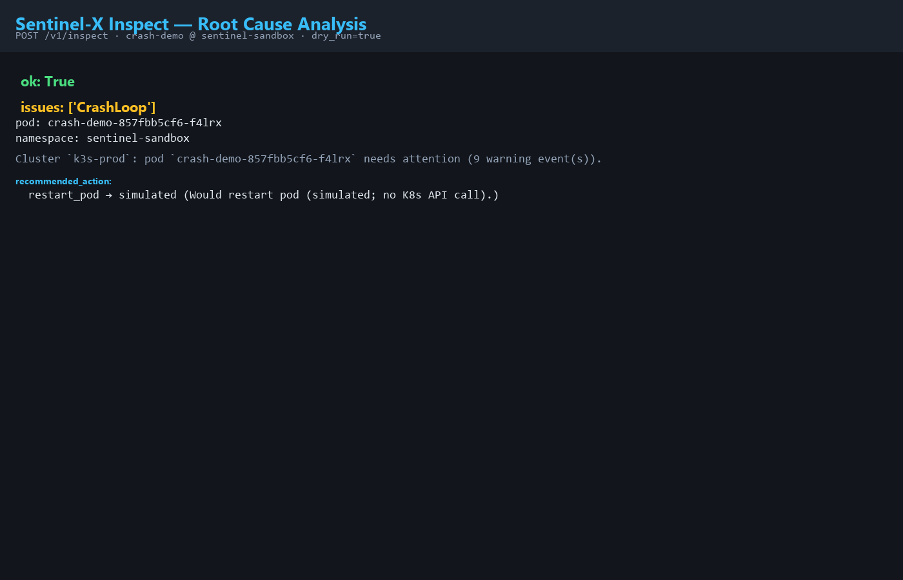
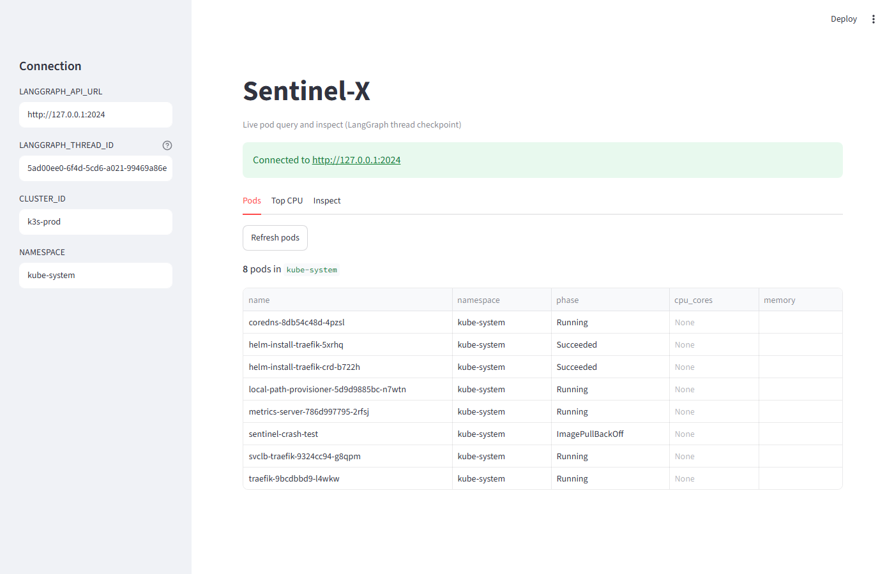
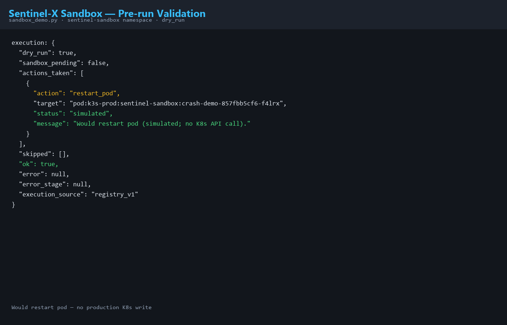
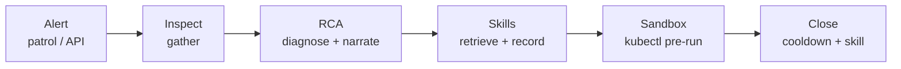
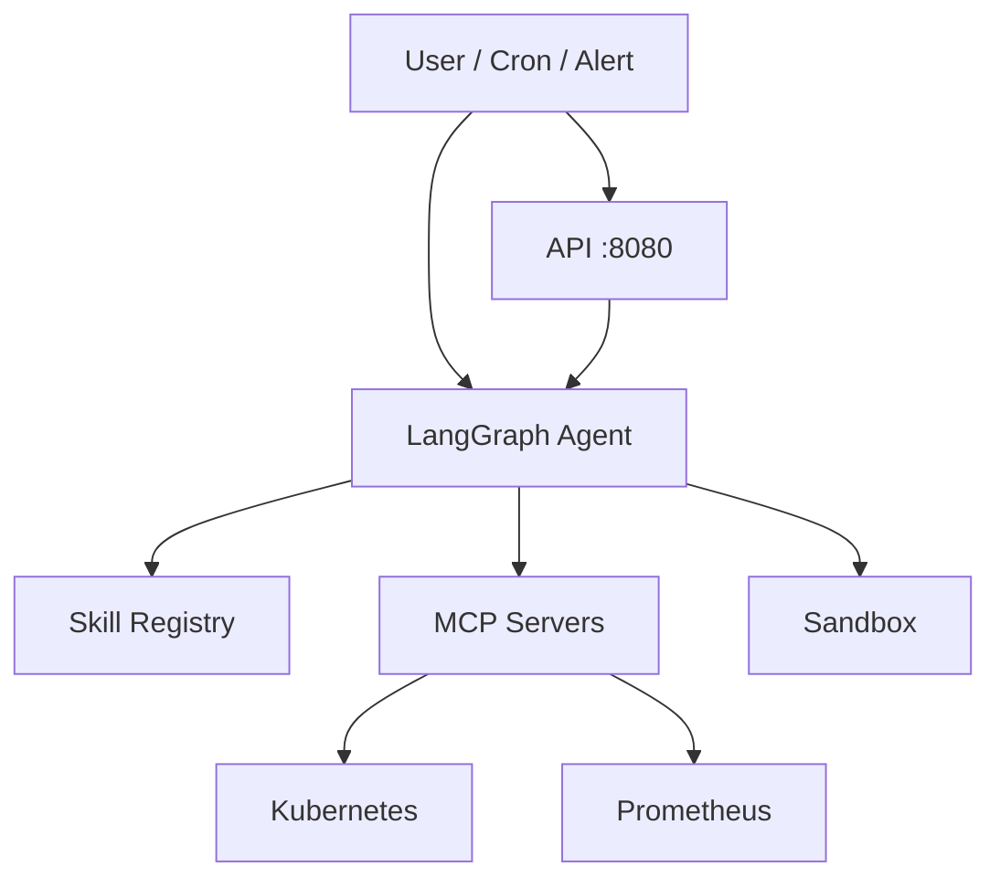

# Sentinel-X

**AI-native SRE Agent Platform** · **云原生自愈 Agent 平台**

> Detect → diagnose → validate in sandbox → trigger remediation for Kubernetes incidents.  
> 基于 MCP 与微沙箱的云原生自愈 Agent，实现 **查 / 判 / 试 / 记 / 触** 闭环。

---

## What problem does Sentinel-X solve? | 解决什么问题

**English:** Traditional monitoring tells operators that something is wrong. Sentinel-X attempts to:

1. **Detect** unhealthy pods and alerts (cron patrol, API, webhooks)
2. **Diagnose** root causes (rule-based RCA + optional LLM narrative)
3. **Validate** fixes in an isolated Docker sandbox before any production write
4. **Trigger** automated inspect / remediation workflows (dry-run by default)

Goal: **lower MTTR** for Kubernetes incidents. This is an **SRE agent**, not a chatbot.

**中文：** 传统监控只告诉你「有问题」。Sentinel-X 尝试完成 **检测 → 根因分析 → 沙箱验证修复 → 触发自动化处置**（默认 dry-run），缩短 K8s 故障 **MTTR**。这是 **运维 Agent**，不是聊天机器人。

---

## Demo

<p align="center">
  
</p>
<p align="center"><sub><b>Inspect RCA</b> · <code>POST /v1/inspect</code> → <code>issues: CrashLoop</code> → <code>restart_pod</code></sub></p>

<p align="center">
  
</p>
<p align="center"><sub><b>Streamlit UI</b> · Pods / top CPU / inspect (<code>apps/ui/</code> · live k3s-prod)</sub></p>

<p align="center">
  
</p>
<p align="center"><sub><b>Sandbox verify</b> · <code>sandbox_demo.py</code> dry-run · simulated restart</sub></p>

Live evidence: [2026-W26](docs/weekly/2026-W26.md) · Full install: [DEPLOY-ONE-SHOT.md](docs/deploy/DEPLOY-ONE-SHOT.md)

---

## Workflow | 业务闭环



Deep dive: [alert-loop architecture](docs/architecture/alert-loop.md) · [ADR](docs/adr/README.md)

---

## Current scale | 当前规模

| Metric | Value | 指标 |
|--------|-------|------|
| MCP servers | **2** (K8s + Prometheus) | MCP 服务 |
| MCP tool endpoints | **4** | 工具端点 |
| LangGraph pipeline nodes | **10+** | 图节点 |
| Production workflows | **4** (sync, inspect E2E, patrol, sandbox) | 生产工作流 |
| Integration tests | **210+** cases · **40+** test files | 集成测试 |
| ADR documents | **4** | 架构决策记录 |

---

## Quick start | 快速开始

**~5 min on a fresh Linux server (k3s):**

```bash
git clone https://github.com/LeoChen1122/sentinel-x.git && cd sentinel-x
sudo bash deploy/install/install-sentinel-x.sh
sudo verify-sentinel-x.sh --full
```

<details>
<summary>Local dev (UI + LangGraph) · 本地开发</summary>

```bash
python -m venv .venv && source .venv/bin/activate   # Windows: .venv\Scripts\activate
pip install -U "langgraph-cli[inmem]"
pip install -r agents/langgraph-server/requirements.txt
pip install -r agents/langgraph-integration/requirements.txt
pip install -r apps/ui/requirements.txt

# Terminal 1
cd agents/langgraph-server && langgraph dev --host 127.0.0.1 --port 2024 --no-browser

# Terminal 2
export LANGGRAPH_RUN_LIVE=1 LANGGRAPH_API_URL=http://127.0.0.1:2024
streamlit run apps/ui/app.py
```

Tests: `python -m unittest discover -s agents/langgraph-integration/tests -v`

</details>

<details>
<summary>Production step-by-step · 分步部署</summary>

See **[docs/deploy/DEPLOY-SERVER.md](docs/deploy/DEPLOY-SERVER.md)** and **[DEPLOY-ONE-SHOT.md](docs/deploy/DEPLOY-ONE-SHOT.md)**.

Order: k3s → MCP kubeconfig → LangGraph systemd → cron sync → (optional) Prom / UI / API.

</details>

---

## Features

| Capability | EN | 中文 |
|------------|-----|------|
| Observability | Kubernetes + Prometheus via MCP | K8s / Prom 可观测性 |
| Analysis | Rule-based RCA + optional LLM | 根因分析 |
| Skills | Markdown runbooks + SQLite FTS | Skill 检索与沉淀 |
| Integration | Model Context Protocol servers | MCP 工具层 |
| Validation | Docker sandbox (namespace allowlist) | 沙箱预演 |
| Deploy | One-shot bash install on k3s | 一键部署 |
| Alert close | Cron patrol + API inspect (W7) | 告警巡检与触发 |

---

## Architecture



**Diagrams:** [docs/architecture/](docs/architecture/README.md) · **Review:** [ARCHITECTURE-REVIEW v3](docs/ARCHITECTURE-REVIEW.md)

---

## Roadmap

| Version | Theme | Status |
|---------|-------|--------|
| **v0.1** | Monitoring MVP — K8s MCP, sync, list_pods | Released |
| **v0.2** | Agent Runtime — LangGraph inspect pipeline | Released |
| **v0.3** | Prometheus MCP — metrics in graph | Released |
| **v0.4** | One-shot Deploy + W7 Alert Auto Close | **Current** |

[CHANGELOG.md](CHANGELOG.md) · [docs/ROADMAP.md](docs/ROADMAP.md)

---

## Implementation status

| Area | Status | Location |
|------|--------|----------|
| K8s / Prom MCP | **Live** | `mcp-servers/` |
| LangGraph graph + sync/query | **Live** | `agents/langgraph-integration/`, `agents/langgraph-server/` |
| P0 one-shot install (W1–W7) | **Live ✅** | `deploy/install/install-sentinel-x.sh` |
| Streamlit UI (W4) | **Minimal live** | `apps/ui/` |
| Alert patrol + inspect (W7) | **Live ✅** | `src/trigger/`, `deploy/sync/sentinel-inspect-patrol.sh` |
| FastAPI (W7) | **Live optional** | `apps/api/` — `/health` + `POST /v1/inspect` |
| Skills (W5) / Sandbox (W6) | **Live** | `skills/`, `sandbox/` |

Package README: [agents/langgraph-integration/README.md](agents/langgraph-integration/README.md)

<details>
<summary>Directory structure · 目录结构</summary>

```text
sentinel-x/
├── agents/          # langgraph-integration + langgraph-server
├── apps/            # api (FastAPI) + ui (Streamlit)
├── mcp-servers/     # k8s, prometheus, compose
├── skills/          # Markdown + SQLite FTS (W5)
├── sandbox/         # Docker kubectl executor (W6)
├── deploy/          # install, config, sync, systemd, verify
└── docs/            # adr, architecture, dev-log, deploy, weekly
```

</details>

<details>
<summary>Skill template (W5) · Skill 模板</summary>

See [`skills/TEMPLATE.md`](skills/TEMPLATE.md). Frontmatter = general knowledge; **Evidence** = cluster/namespace/pod only.

</details>

---

## Security policy

1. **Read-only** (default): metrics / events / graph query  
2. **Sandbox** (W6): `dry_run=false` only in `sentinel-sandbox` namespace  
3. **Production execute** (W8+): `SENTINEL_EXECUTE_LIVE=1` — not implemented  

Default deny: delete namespace, bulk cleanup, arbitrary shell, non-whitelisted kubectl.

---

## Related docs

| Doc | Topic |
|-----|-------|
| [docs/architecture/](docs/architecture/README.md) | Architecture diagrams |
| [docs/adr/](docs/adr/README.md) | Architecture decision records |
| [docs/dev-log/](docs/dev-log/README.md) | Portfolio dev log |
| [CHANGELOG.md](CHANGELOG.md) | Version history |
| [docs/deploy/DEPLOY-ONE-SHOT.md](docs/deploy/DEPLOY-ONE-SHOT.md) | One-command install |
| [docs/.github-import/](docs/.github-import/README.md) | GitHub Project / Release (bilingual) |
