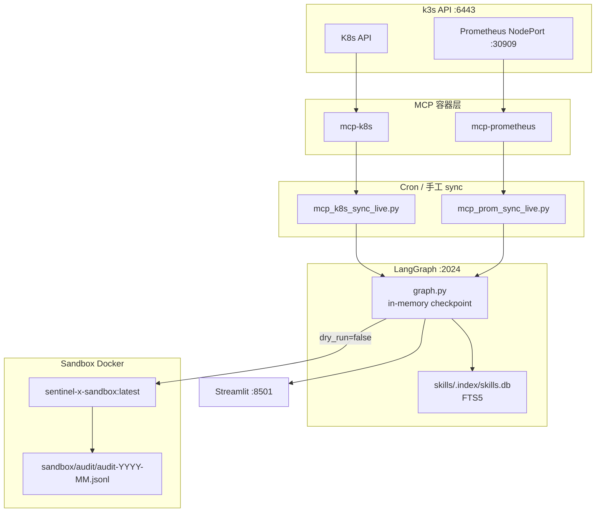

# Sentinel-X 架构评审（第二版）

> **评审日期**：2026-06-05  
> **基线**：W1–W6 **代码完成**（W1–W4 生产 live 已验收；W5 Skills、W6 沙箱单测与图节点已接线；W6 **live 沙箱未验收**）  
> **范围**：`agents/`、`mcp-servers/`、`apps/`、`deploy/`、`skills/`、`sandbox/`、`docs/`、`dist/`  
> **上一版**：2026-06-04 v1（W1–W4 基线）

---

## 0. 与 v1 差异摘要

| 维度 | v1（2026-06-04） | v2（2026-06-05） |
|------|------------------|------------------|
| 路线图基线 | W1–W4 live | W1–W4 live + **W5/W6 代码落地** |
| `skills/` | 占位 / 未实现 | **Live** — FTS 检索 + `record_skill` 图节点 |
| `sandbox/` | 占位 / 未实现 | **Live（代码）** — Docker kubectl + 审计 + Ready 30s 验证 |
| LangGraph 流水线 | ingest → gather → diagnose → narrate → execute → query | 新增 **retrieve_skills → sandbox_run → verify_skill → record_skill** |
| 「查判试记」 | 仅「查」「判」live | 「记」单测通过；「试」代码完成、**live 待验** |
| P0 一键部署 | v1 文末标 ✅ | 脚本已入库，**新机 live 验收未写入 W23**（见 §7） |
| 单测规模 | ~150+ | ~200+（新增 `test_skills_*`、`test_sandbox_*`） |

---

## 1. 当前架构（实际 vs 愿景）

### 1.1 组件映射

| 组件 | 实际位置 | README / 愿景 | 状态 |
|------|----------|---------------|------|
| K8s MCP | `mcp-servers/k8s/` + `docker-compose.yml` | MCP 工具层 | **Live** |
| Prometheus MCP | `mcp-servers/prometheus/` | 同上 | **Live** |
| 数据面（Adapter / Sync / Query） | `agents/langgraph-integration/src/` | LangGraph 集成 | **Live** |
| 编排图 | `agents/langgraph-server/src/graph.py` | Agent 图 | **Live** — 含 W5/W6 节点 |
| Skills 存储与检索 | `skills/` + `src/skills/` | W5「记」 | **Live（代码+单测）** |
| 沙箱预演 | `sandbox/` + `src/sandbox/` | W6「试」 | **Live（代码）** / **live 未验收** |
| 运维脚本 | `deploy/*.sh`、`deploy/*.service` | deploy 模板 | **Live** |
| 一键安装 | `deploy/install/install-sentinel-x.sh` | P0 | **脚本存在**；新机验收见 §7 |
| 部署文档 | `docs/deploy/DEPLOY-*.md`、`DEPLOY-REFERENCE.md` | 文档 | **Live** |
| Streamlit UI | `apps/ui/app.py` | MVP UI | **Minimal live** |
| 离线 Prom bundle | `dist/kube-prometheus-offline/` | 运维用 | **Live** |
| FastAPI `apps/api` | — | W7 可选 | **未实现** |
| 根目录 `docker-compose.yml` | — | 统一 compose | **未实现**（仅 `mcp-servers/`） |
| 顶层 `configs/clusters.yaml` | `agents/langgraph-integration/configs/tenants.example.yaml` | 多集群 | **仅 mock/示例** |
| `SENTINEL_EXECUTE_LIVE=1` | `src/agent/execute.py` | W8+ 生产写 | **未实现**（显式 `NotImplementedError`） |

### 1.2 LangGraph 流水线（W6 后）

实际边序（[`graph.py`](../agents/langgraph-server/src/graph.py)）：

```text
START → ingest → gather → diagnose → retrieve_skills → narrate
      → execute → sandbox_run → verify_skill → record_skill → query → END
```

| 节点 | 职责 | 关键依赖 |
|------|------|----------|
| `gather` / `diagnose` | 查 + 判 | `agent/gather.py`、`agent/diagnose.py` |
| `retrieve_skills` | 判后检索历史 Skill | `skills/retrieve.py` → SQLite FTS5 |
| `narrate` | 叙事（含 Similar past skills） | `agent/narrative.py`；LLM 可选 |
| `execute` | 三态：`dry_run` / `sandbox_pending` / live 拒绝 | `agent/execute.py` |
| `sandbox_run` | Docker 内 kubectl 子集 | `sandbox/runner.py` |
| `verify_skill` | 沙箱 Ready 持续 ≥30s → `verified` | `sandbox/verifier.py` |
| `record_skill` | Markdown upsert + FTS 索引 | `skills/writer.py`、`skills/store.py` |

### 1.3 与 README 愿景差距

- README **Implementation status** 已与 W5/W6 对齐（[`README.md`](../README.md)）。
- 仍缺：`apps/api/`、根 `docker-compose.yml`、多集群 live、`SENTINEL_EXECUTE_LIVE` 生产写。
- W6 live 需：`docker build sandbox/`、`fixtures/crash-loop-deployment.yaml`、生产机 Docker — 见 [`sandbox/README.md`](../sandbox/README.md)。

---

## 2. 运行时拓扑



**运维契约**（与 v1 一致）：LangGraph 重启后图状态依赖 **cron 增量 sync** 重建；checkpoint 仍为内存型（见 §6）。

---

## 3. 「查 / 判 / 试 / 记」闭环状态

| 阶段 | 含义 | 完成度 | 验收证据 |
|------|------|--------|----------|
| **查** | MCP → 图 → Query | **Live ✅** | W1–W3：`list_pods`、`top_pods_by_cpu`；[`DEPLOY-REFERENCE.md`](deploy/DEPLOY-REFERENCE.md) |
| **判** | gather → diagnose → narrate | **Live ✅** | W2 inspect E2E；[`DEPLOY-INSPECT-LIVE.md`](deploy/DEPLOY-INSPECT-LIVE.md) |
| **试** | execute → sandbox → verify | **代码 ✅ / Live ⏳** | 单测：`test_sandbox_*`、`test_skills_sandbox_integration.py`；**无 W23 live 记录** |
| **记** | retrieve → record_skill | **代码 ✅ / 生产待验** | 单测：`test_skills_retrieve_integration.py`；示例 [`skills/examples/fix-crashloop-restart.md`](../skills/examples/fix-crashloop-restart.md) |

**execute 三态**（[`execute.py`](../agents/langgraph-integration/src/agent/execute.py)）：

| `dry_run` | `SENTINEL_EXECUTE_LIVE` | 行为 |
|-----------|-------------------------|------|
| `true` | — | 模拟动作，无沙箱 |
| `false` | off | `sandbox_pending` → `sandbox_run` |
| `false` | `1` | **`NotImplementedError`（W8+）** |

**verified 语义**：仅当沙箱验证通过（Deployment Pod **Ready 持续 ≥ `SENTINEL_SANDBOX_READY_SEC`（默认 30s）**）时，`record_skill` 写入 `verified: true`（[`verifier.py`](../agents/langgraph-integration/src/sandbox/verifier.py)、[`skills/README.md`](../skills/README.md)）。

---

## 4. 架构合理性

### 4.1 数据流

| 阶段 | 路径 | 评价 |
|------|------|------|
| 采集 | MCP 容器 → K8s/Prom API → JSON | 清晰；凭证隔离在容器内 |
| 传输 | `mcp_k8s.py` / `mcp_prom.py` + `docker exec` | 务实；强依赖容器名 |
| 适配 | `adapter/k8s.py`、`adapter/metrics.py` → `GraphBatch` | 边界清楚 |
| 写入 | `sync/pipeline.py` → `ingest` stream | 与 query 共用 thread |
| 诊断链 | gather → diagnose → retrieve → narrate | W5 检索不污染 gather 快照 |
| 动作链 | execute → sandbox → verify → record | W6 与生产 ns **硬隔离**（`sentinel-sandbox`） |
| 读取 | `query/operations.py` + `query` 节点 | 单 thread 视图一致 |

**增量 sync**：`sync/state.py` 指纹 + `/var/lib/sentinel/sync-state`；与 in-memory checkpoint 形成可接受运维契约（重启后 cron 重建实体图；inspect payload 仍可能丢失）。

### 4.2 边界与优点

**优点：**

- MCP 与 integration **进程分离**；`langgraph-server` 薄包装，业务集中在 `langgraph-integration/src`。
- Skills 通过 `SkillStore` Protocol（[`store.py`](../agents/langgraph-integration/src/skills/store.py)）可换后端，图节点稳定。
- 沙箱 **policy → planner → executor → verifier → audit** 分层（[`src/sandbox/`](../agents/langgraph-integration/src/sandbox/)），审计按月轮转 JSONL（[`sandbox/audit/`](../sandbox/audit/)）。
- `deploy/` 纯 shell/systemd，不嵌入 Python 业务。

**耦合点（可接受，需文档）：**

- `graph.py` 仍用 `sys.path.insert` 导入 integration（§6）。
- `thread_id`、`cluster_id`、MCP 容器名散布 env / cron / UI（UI 已用 `resolve_langgraph_thread_id`）。
- Prom 依赖 NodePort + `host.docker.internal`，与 k3s 网络绑定。

### 4.3 分层评价

| 层 | 示例 | 结论 |
|----|------|------|
| MCP tools | `mcp-servers/k8s/src/tools/` | 薄，合适 |
| Clients | `clients/mcp_k8s.py`, `mcp_prom.py` | 对称性好 |
| Skills | `skills/retrieve.py`, `writer.py` | W5 职责清晰，非过度抽象 |
| Sandbox | `sandbox/runner.py`, `policy.py` | W6 安全边界明确 |
| Agent | `agent/diagnose.py`, `narrative.py` | 规则+模板为主；**LLM 可选**（DashScope，W2-4 未强制 live） |
| Sync | `sync/pipeline.py` | 职责集中，略长但可维护 |

---

## 5. 代码健康（摘要）

### 5.1 测试覆盖

| 区域 | 位置 | 覆盖 |
|------|------|------|
| Integration | `agents/langgraph-integration/tests/`（~35 文件，~200+ `def test_`） | **强**：adapter、sync、query、agent、**skills、sandbox** |
| LangGraph server | `agents/langgraph-server/tests/test_graph_nodes.py`（7 用例） | **中**：含 sandbox 节点 smoke |
| MCP | `mcp-servers/prometheus/tests/` | 中；k8s 偏 mock |
| E2E live | `test_langgraph_inspect_live.py` | 默认 skip |
| UI / deploy | — | **缺口** |

**结论**：W5/W6 核心路径单测充分；**生产路径**（docker exec、systemd、沙箱 live、一键安装）仍依赖手工与 runbook。

### 5.2 冗余与文档

- DEPLOY 系列仍有多处重复参数；canonical 入口为 [`DEPLOY-REFERENCE.md`](deploy/DEPLOY-REFERENCE.md) + [`DEPLOY-ONE-SHOT.md`](deploy/DEPLOY-ONE-SHOT.md)。
- `deploy/prometheus/` 与 `dist/kube-prometheus-offline/` 脚本镜像维护（dist 为离线 copy）。
- demo 脚本已隔离至 `agents/langgraph-integration/scripts/demo/`。

---

## 6. 风险与技术债

| 风险 | 严重度 | 现状 / 缓解 |
|------|--------|-------------|
| **LangGraph in-memory checkpoint** | P1 运维 | post-restart hook + cron sync 契约；**W8+ Postgres/SQLite 持久化待调研**（[`ROADMAP.md`](ROADMAP.md) §W8+） |
| **W6 live 沙箱未验收** | P1 闭环 | 需镜像 + fixture + 生产 Docker；阻塞「试」端到端演示 |
| **verify Ready 30s** | P2 产品 | 默认 `SENTINEL_SANDBOX_READY_SEC=30`；慢启动 Deployment 可能误拒 `verified` |
| **审计按月 JSONL** | P2 运维 | `audit-YYYY-MM.jsonl` 无自动归档策略；长期磁盘需监控 |
| **一键部署 live 验收** | P0 运维 | `install-sentinel-x.sh` 已入库；W23 记录「评审后 plan 保留、下周验收」 |
| **`sys.path` 注入** | P1 工程 | `graph.py`、`apps/ui/app.py`、大量 tests；integration 无 `pyproject.toml` 可编辑安装 |
| **`SENTINEL_EXECUTE_LIVE` 未实现** | 安全（预期） | 默认拒绝 live 写；W8+ 需审批与 Action MCP |
| **LLM 可选未 prod 固化** | P2 | DashScope timeout / 降级路径未写入 live 验收 |
| **docker-compose v1 `ContainerConfig`** | P1 运维 | `docker rm` + `up -d` workaround |
| **多集群 mock only** | P2 | `sync/multicluster.py` live 0% |
| **`.langgraph_api/*.pckl` 入库** | P3 | 本地 dev 产物污染 git status |

---

## 7. 建议（按优先级）

### P0 — 新机可复现（下周）

1. **一键安装 live 验收**：`sudo bash deploy/install/install-sentinel-x.sh` + `deploy/verify/verify-sentinel-x.sh --after-restart` 写入 [`docs/weekly/`](weekly/)。
2. **W6 沙箱 live**：`docker build -t sentinel-x-sandbox:latest sandbox/` → apply fixture → `dry_run=false` inspect → 检查 `sandbox/audit/` 与 `skill_verification.verified`。
3. 保持 [`DEPLOY-ONE-SHOT.md`](deploy/DEPLOY-ONE-SHOT.md) 为唯一新机入口。

### P1 — 1–2 周

1. **Checkpoint Phase 2 spike**（ROADMAP W8+）：评估 Postgres checkpointer 对 `thread_id` / inspect payload 的影响。
2. **W7 告警入口**：Event 阈值或 cron 巡检触发 inspect（`apps/api` 可选薄层）。
3. **`pip install -e` integration**，逐步去掉 `graph.py` / UI 的 `sys.path`。
4. docker compose v2 检测写入 installer。

### P2 — Phase 2 前

1. **多集群 live**：`configs/clusters.yaml` 驱动 sync cron 多实例。
2. UI mock LangGraph 集成测试。
3. Skills 后端可插拔（Chroma）仅在 Protocol 层验证，不阻塞 MVP。
4. 审计日志轮转 / 压缩策略。

---

## 8. 公平评价与评分

### 8.1 相对 v1 的进步

- **闭环完整性**：从「查+判」扩展到图内 **retrieve / sandbox / verify / record**，与 README「查判试记」叙事一致。
- **可测试性**：W5/W6 新增 ~20+ 用例，含 `test_skills_sandbox_integration.py` 跨节点场景。
- **安全默认值**：生产 ns 写操作默认 block；live execute 显式未实现；沙箱 policy 白名单 kubectl。
- **文档诚实度**：README / ROADMAP 标注 W6 live 待验、`apps/api` 未实现。

### 8.2 仍存在的短板

- **Live 深度**：W5/W6 主要在 dev/单测；生产服务器尚未证明「第二次 CrashLoop 命中 Skill + 沙箱 verified」。
- **运维自动化 E2E**：一键脚本 vs 实际新机验收存在 **文档/周报不一致**（v1 标 ✅，W23 标推迟）。
- **持久化**：checkpoint 与 Skills DB 仍随部署目录/local 路径，无 HA 故事。

### 8.3 评分（10 分制，相对 MVP 目标）

| 维度 | v1 | v2 | 说明 |
|------|----|----|------|
| 架构方向 | 8.0 | **8.5** | 图流水线与 MVP 愿景对齐 |
| 生产 live 就绪 | 7.5 | **7.5** | W1–W4 稳；W5/W6 live 未加分 |
| 代码质量 / 单测 | 7.5 | **8.0** | skills+sandbox 测试补强 |
| 运维体验 | 6.5 | **7.0** | 一键脚本入库；live 验收待补 |
| 文档一致性 | 7.0 | **7.5** | ROADMAP W23 + README 同步 |
| **综合** | **7.3** | **7.7** | 适合进入 W7；不宜在大重构前阻塞 |

### 8.4 总结

Sentinel-X 在 Phase 1（看见系统 + inspect）上 **架构稳定**；W5/W6 将「记」「试」**代码化进同一条 LangGraph 流水线**，是 v1 之后最显著的结构演进。当前瓶颈不在建模，而在 **live 验收广度**（沙箱、一键部署、告警驱动）与 **checkpoint / packaging 工程债**。建议优先 P0 live 闭环演示，再推进 W7 半自动与 W8+ 持久化 execute。

---

## 9. 相关文档

| 文档 | 主题 |
|------|------|
| [`README.md`](../README.md) | Implementation status |
| [`docs/ROADMAP.md`](ROADMAP.md) | W1–W8+ 周计划 |
| [`docs/weekly/2026-W23.md`](weekly/2026-W23.md) | W5/W6 周总结 |
| [`docs/deploy/DEPLOY-REFERENCE.md`](deploy/DEPLOY-REFERENCE.md) | 环境变量 SSOT |
| [`skills/README.md`](../skills/README.md) | Skills 布局与 FTS |
| [`sandbox/README.md`](../sandbox/README.md) | 沙箱策略与 fixture |
