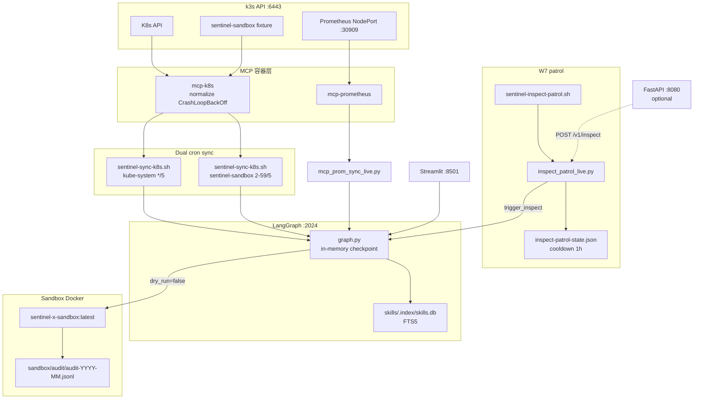

# Sentinel-X 架构评审（第三版）

> **评审日期**：2026-06-17（**v3**：W25 P0 one-shot live + W26 W7 auto patrol）  
> **基线**：W1–W7 **live 已验收**（含 P0 全栈 install、`verify --full`、cron patrol + cooldown）  
> **Live 证据**：[`2026-W25.md`](weekly/2026-W25.md)、[`2026-W26.md`](weekly/2026-W26.md)  
> **生产服务器**：`root@47.120.6.221` / `/opt/sentinel-x`  
> **范围**：`agents/`、`mcp-servers/`、`apps/`、`deploy/`、`skills/`、`sandbox/`、`docs/`、`dist/`  
> **上一版**：2026-06-09 v2.1（W1–W6 基线）

---

## 0. 与 v2 差异摘要

| 维度 | v2.1（2026-06-09） | v3（2026-06-17） |
|------|-------------------|------------------|
| 路线图基线 | W1–W6 live | **W1–W7 live**（含 trigger / patrol） |
| P0 一键部署 | installer 完成；one-shot **待 SSH** | **全栈 live ✅**（reset → install → `verify --full`） |
| W7 告警入口 | §7 建议项；`apps/api` 代码完成 | **cron patrol live ✅**；`trigger/` 模块；DEPLOY-ALERT-INSPECT 核心 4 项勾选 |
| MCP Pod status | 仅 `phase` → CrashLoop 显示 Running | **`normalize.py`** → `CrashLoopBackOff`；[`test_normalize_pod_list.py`](../mcp-servers/k8s/tests/test_normalize_pod_list.py) |
| Sync 运维 | 单 namespace cron | **双 cron**：kube-system + `sentinel-sandbox`（[`cron-sentinel-sync.example`](../deploy/sync/cron-sentinel-sync.example)） |
| 单测规模 | ~200+ | **~210+**（+`test_trigger_patrol`、`test_inspect_trigger`、normalize） |
| 瓶颈 | W7 告警、checkpoint | **半自动闭环已通**；下一瓶颈 → **持久化 checkpoint**、**Alertmanager webhook live**、**生产写** |

**v2.1 回顾**：W5/W6 生产 live — [`2026-W23.md §7`](weekly/2026-W23.md)。

---

## 1. 当前架构（实际 vs 愿景）

### 1.1 组件映射

| 组件 | 实际位置 | README / 愿景 | 状态 |
|------|----------|---------------|------|
| K8s MCP | `mcp-servers/k8s/` + compose | MCP 工具层 | **Live** — normalize 取 container waiting reason |
| Prometheus MCP | `mcp-servers/prometheus/` | 同上 | **Live** |
| 数据面（Adapter / Sync / Query） | `agents/langgraph-integration/src/` | LangGraph 集成 | **Live** |
| 编排图 | `agents/langgraph-server/src/graph.py` | Agent 图 | **Live** — 含 W5/W6 节点 |
| W7 trigger 层 | `src/trigger/` | 告警 / patrol 入口 | **Live ✅** — `patrol.py`、`inspect_trigger.py`、`config.py` |
| Skills 存储与检索 | `skills/` + `src/skills/` | W5「记」 | **Live ✅** |
| 沙箱预演 | `sandbox/` + `src/sandbox/` | W6「试」 | **Live ✅** |
| 运维脚本 | `deploy/*.sh`、`deploy/*.service` | deploy 模板 | **Live** |
| 一键安装 | `deploy/install/install-sentinel-x.sh` | P0 | **Live ✅** — W25 全栈验收 + `reset-sentinel-x.sh` |
| `verify --full` | `deploy/verify/verify-sentinel-x.sh` | W5–W7 检查 | **Live ✅** |
| Patrol cron | `deploy/sync/sentinel-inspect-patrol.sh` | W7 | **Live ✅** — cooldown state + 双 ns 扫描 |
| 部署文档 | `docs/deploy/DEPLOY-*.md` | 文档 | **Live** |
| Streamlit UI | `apps/ui/app.py` | MVP UI | **Minimal live** |
| 离线 Prom bundle | `dist/kube-prometheus-offline/` | 运维用 | **Live** |
| FastAPI `apps/api` | `apps/api/` | W7 可选 | **Live（可选）** — `--with-api` + `/health`；`POST /v1/inspect` **未 live curl** |
| 根目录 `docker-compose.yml` | — | 统一 compose | **未实现**（仅 `mcp-servers/`） |
| 顶层 `configs/clusters.yaml` | `configs/tenants.example.yaml` | 多集群 | **仅 mock/示例** |
| `SENTINEL_EXECUTE_LIVE=1` | `src/agent/execute.py` | W8+ 生产写 | **未实现**（显式 `NotImplementedError`） |
| Alertmanager webhook | `apps/api/routes/webhooks.py` | W7 事件驱动 | **代码完成，live 未验收** |

### 1.2 LangGraph 流水线（图内，W6 后不变）

实际边序（[`graph.py`](../agents/langgraph-server/src/graph.py)）：

```text
START → ingest → gather → diagnose → retrieve_skills → narrate
      → execute → sandbox_run → verify_skill → record_skill → query → END
```

| 节点 | 职责 | 关键依赖 |
|------|------|----------|
| `gather` / `diagnose` | 查 + 判 | `agent/gather.py`、`agent/diagnose.py` |
| `retrieve_skills` | 判后检索历史 Skill | `skills/retrieve.py` → SQLite FTS5 |
| `narrate` | 叙事（含 Similar past skills） | `agent/narrative.py`；LLM 可选 |
| `execute` | 三态：`dry_run` / `sandbox_pending` / live 拒绝 | `agent/execute.py` |
| `sandbox_run` | Docker 内 kubectl 子集 | `sandbox/runner.py` |
| `verify_skill` | 沙箱 Ready 持续 ≥30s → `verified` | `sandbox/verifier.py` |
| `record_skill` | Markdown upsert + FTS 索引 | `skills/writer.py`、`skills/store.py` |

### 1.3 W7 触发面（图外）

[`DEPLOY-ALERT-INSPECT.md`](deploy/DEPLOY-ALERT-INSPECT.md)：

```text
[cron sentinel-inspect-patrol.sh] ──┐
[POST /v1/inspect]                  ├──► trigger_inspect ──► 既有 inspect 图链
[POST /v1/webhooks/alertmanager]    ──┘         (dry_run 默认 true)
```

共享模块：[`agents/langgraph-integration/src/trigger/`](../agents/langgraph-integration/src/trigger/)。

### 1.4 与 README 愿景差距

- v3 评审以 **ROADMAP + W25/W26** 为准；[`README.md`](../README.md) Implementation status 已与 v3 同步（2026-06-17）。
- 仍缺：根 `docker-compose.yml`、多集群 live、`SENTINEL_EXECUTE_LIVE` 生产写、Alertmanager webhook live、`POST /v1/inspect` live curl。

---

## 2. 运行时拓扑



**运维契约**：LangGraph 重启后实体图依赖 **cron 增量 sync** 重建；inspect payload 仍可能丢失（in-memory checkpoint，见 §6）。W26 起 sandbox fixture 需 **第二行 cron sync**，与 kube-system 解耦。

---

## 3. 「查 / 判 / 试 / 记 / 触」闭环状态

| 阶段 | 含义 | 完成度 | 验收证据 |
|------|------|--------|----------|
| **查** | MCP → 图 → Query | **Live ✅** | W1–W3；[`DEPLOY-REFERENCE.md`](deploy/DEPLOY-REFERENCE.md) |
| **判** | gather → diagnose → narrate | **Live ✅** | W2 inspect E2E；[`DEPLOY-INSPECT-LIVE.md`](deploy/DEPLOY-INSPECT-LIVE.md) |
| **试** | execute → sandbox → verify | **Live ✅** | W6；[`2026-W23.md §7`](weekly/2026-W23.md) |
| **记** | retrieve → record_skill | **Live ✅** | W5；Similar past skills |
| **触**（cron patrol） | patrol → trigger_inspect | **Live ✅** | W26：`crash-demo` auto → `issues=['CrashLoop']`；cooldown |
| **触**（API / Alertmanager） | HTTP → trigger_inspect | **代码完成，live 未验收** | DEPLOY-ALERT-INSPECT 可选项未勾 |

**Patrol 设计要点**（W26）：

- 显式 graph `status` 优先于 events 推断；events 兜底仅 `Running` + `CrashLoopBackOff` 事件
- 多 namespace：`kube-system` + `SENTINEL_PATROL_EXTRA_NAMESPACES=sentinel-sandbox`
- 默认 `SENTINEL_PATROL_DRY_RUN=true`；cooldown `SENTINEL_PATROL_COOLDOWN_SEC=3600`
- MCP normalize 与 patrol / `inspect_patrol_live.py` 需 **同版本部署**（rebuild MCP + 多 ns 脚本）

**execute 三态**（[`execute.py`](../agents/langgraph-integration/src/agent/execute.py)）：

| `dry_run` | `SENTINEL_EXECUTE_LIVE` | 行为 |
|-----------|-------------------------|------|
| `true` | — | 模拟动作，无沙箱 |
| `false` | off | `sandbox_pending` → `sandbox_run` |
| `false` | `1` | **`NotImplementedError`（W8+）** |

**verified 语义**：沙箱 Pod **Ready 持续 ≥ `SENTINEL_SANDBOX_READY_SEC`（默认 30s）** → `verified: true`（[`verifier.py`](../agents/langgraph-integration/src/sandbox/verifier.py)）。

---

## 4. 架构合理性

### 4.1 数据流

| 阶段 | 路径 | 评价 |
|------|------|------|
| 采集 | MCP 容器 → K8s/Prom API → JSON | 清晰；normalize 修复 CrashLoop 可见性 |
| 传输 | `mcp_k8s.py` + `docker exec` | 务实；强依赖容器名 |
| 适配 | `adapter/k8s.py` → `GraphBatch` | 边界清楚 |
| 写入 | `sync/pipeline.py` → `ingest` stream | 与 query 共用 thread |
| 诊断链 | gather → diagnose → retrieve → narrate | W5 检索不污染 gather 快照 |
| 动作链 | execute → sandbox → verify → record | W6 与生产 ns **硬隔离** |
| 触发链 | patrol / API → `trigger_inspect` → stream | **与图解耦**；不新增图节点 |
| 读取 | `query/operations.py` + `query` 节点 | 单 thread 视图一致 |

**增量 sync**：`sync/state.py` 指纹 + `/var/lib/sentinel/sync-state`；与 in-memory checkpoint 形成可接受运维契约。

### 4.2 边界与优点

**优点：**

- MCP 与 integration **进程分离**；`langgraph-server` 薄包装，业务集中在 `langgraph-integration/src`。
- **Trigger 层**（`src/trigger/`）共用 `stream_sentinel_run`，patrol / API / webhook 不污染图节点。
- Skills 通过 `SkillStore` Protocol 可换后端；沙箱 **policy → planner → executor → verifier → audit** 分层清晰。
- `deploy/` 纯 shell/systemd；P0 **reset → install → verify --full** 可重复。

**耦合点（可接受，需文档）：**

- **MCP 与 Patrol 职责边界**：status 归 MCP normalize；候选筛选归 patrol — W26 教训：仅 scp patrol 不够，需 rebuild MCP + `inspect_patrol_live.py` 多 ns。
- **双 cron sync**：installer 仅在 `--with-fixtures` 时首 sync sandbox；cron 第二行补长期一致。
- `graph.py` 仍用 `sys.path.insert` 导入 integration（§6）。
- `thread_id`、`cluster_id`、MCP 容器名散布 env / cron / UI。

### 4.3 分层评价

| 层 | 示例 | 结论 |
|----|------|------|
| MCP tools | `mcp-servers/k8s/src/tools/`、`utils/normalize.py` | 薄，合适 |
| Trigger | `trigger/patrol.py`、`inspect_trigger.py` | W7 职责清晰 |
| Clients | `clients/mcp_k8s.py`, `mcp_prom.py` | 对称性好 |
| Skills / Sandbox | `skills/`、`sandbox/` | W5/W6 边界明确 |
| Agent | `agent/diagnose.py`, `narrative.py` | 规则+模板；LLM 可选 |
| Sync | `sync/pipeline.py` | 职责集中，可维护 |

---

## 5. 代码健康（摘要）

### 5.1 测试覆盖

| 区域 | 位置 | 覆盖 |
|------|------|------|
| Integration | `agents/langgraph-integration/tests/`（~35 文件，~210+ `def test_`） | **强**：adapter、sync、query、agent、skills、sandbox、**trigger** |
| Trigger | `test_trigger_patrol.py`（7）、`test_inspect_trigger.py`（2） | **中** — 含 Running 误报回归 |
| MCP k8s | `test_normalize_pod_list.py` | **中** — CrashLoopBackOff |
| LangGraph server | `test_graph_nodes.py`（7） | **中** |
| MCP Prom | `mcp-servers/prometheus/tests/` | 中 |
| E2E live | `test_langgraph_inspect_live.py` | 默认 skip |
| API / deploy | — | **缺口** |

**结论**：W5/W6/W7 trigger 核心路径单测充分；**W25/W26 live 已手工验收**。API route 单测、deploy E2E 仍为缺口。

### 5.2 冗余与文档

- DEPLOY canonical 入口：[`DEPLOY-REFERENCE.md`](deploy/DEPLOY-REFERENCE.md) + [`DEPLOY-ONE-SHOT.md`](deploy/DEPLOY-ONE-SHOT.md) + [`DEPLOY-ALERT-INSPECT.md`](deploy/DEPLOY-ALERT-INSPECT.md)。
- demo 脚本隔离至 `scripts/demo/`；live 脚本在 `scripts/live/`。

---

## 6. 风险与技术债

| 风险 | 严重度 | 现状 / 缓解 |
|------|--------|-------------|
| **LangGraph in-memory checkpoint** | P1 运维 | post-restart hook + cron sync；**W27+ Postgres/SQLite spike** |
| **增量 scp 与镜像漂移** | P2 运维 | W26 靠 scp + docker rebuild；新机应走 tarball + `install-sentinel-x.sh` |
| **Patrol 冷启动 flaky** | P3 | 首次 `ok=false`（execution 空）；cron 5min 可接受 |
| **Patrol 误报（历史）** | 已缓解 | W26 收紧 events 推断；保持 `test_trigger_patrol` |
| **双 namespace sync 锁** | P3 | cron offset 2min + `flock` |
| **`sys.path` 注入** | P1 工程 | `pip install -e` integration 待做 |
| **`SENTINEL_EXECUTE_LIVE` 未实现** | 安全（预期） | W29+ 需审批与 Action MCP |
| **LLM 可选未 prod 固化** | P2 | DashScope timeout / 降级未 live 验收 |
| **docker-compose v1 `ContainerConfig`** | P1 运维 | `docker rm` + `up -d` workaround |
| **多集群 mock only** | P2 | `sync/multicluster.py` live 0% |
| **新机 one-shot 独立复验** | P2 | W25 增量/重装已验；全新 ECS 可选复验 |
| ~~W7 auto patrol 阻塞~~ | — | **W26 已关单** |
| ~~MCP phase-only status~~ | — | **W26 normalize 已修复** |

---

## 7. 建议与项目成长规划

### 7.1 短期建议（按优先级）

**P0 — 文档与一致性（~1 周）**

1. ~~同步 README Implementation status~~ **已完成**（v3 同步；含「触」与 ARCHITECTURE 链接）。
2. ~~W3–W6 验收矩阵补记~~ **已完成**（[`DEPLOY-ONE-SHOT.md`](deploy/DEPLOY-ONE-SHOT.md) §6 Live 状态 + 证据列）。
3. ~~Git 提交 W25–W26 deploy + trigger + normalize 变更~~ **已完成**（见 commit 记录）。

**P1 — 半自动 → 事件驱动（2–4 周，W27–W28）**

1. **Checkpoint Phase 2 spike**：Postgres vs SQLite；`thread_id` / inspect payload 持久化。
2. **`POST /v1/inspect` live** + Bearer `SENTINEL_API_TOKEN`。
3. **Alertmanager webhook** 最小规则 → `/v1/webhooks/alertmanager`。
4. **`pip install -e` integration** — 减少 `sys.path` 注入。
5. docker compose v2 检测写入 installer。

**P2 — MVP 深水区（1–2 月，W29+）**

1. **`SENTINEL_EXECUTE_LIVE=1`** + 审批门 + Action MCP 设计。
2. **多集群 live**（`configs/clusters.yaml` → 多 cron / 多 thread）。
3. **LLM 叙事 prod 固化**（DashScope timeout、降级 SLA）。
4. **新机 ECS one-shot 独立复验**（非增量 scp）。

**P3 — 扩展愿景**

- Chroma / embedding Skills；gVisor；Loki sync；根 `docker-compose.yml`。

### 7.2 成长阶段路线图

```mermaid
flowchart LR
  phase1 [Phase1_SeeAndJudge_W1_W4]
  phase2 [Phase2_TryAndRemember_W5_W6]
  phase3 [Phase3_Trigger_W7]
  phase4 [Phase4_PersistAndEvents_W27_W28]
  phase5 [Phase5_LiveExecute_W29plus]

  phase1 --> phase2 --> phase3 --> phase4 --> phase5
```

| 阶段 | 目标 | 关键产出 | 状态 |
|------|------|----------|------|
| Phase 1 | 看见 + 诊断 | MCP sync、inspect dry-run | **Done** |
| Phase 2 | 试 + 记 | sandbox、Skills FTS | **Done** |
| Phase 3 | 半自动触发 | patrol cron、cooldown、normalize | **Done** |
| Phase 4 | 可运维 + 可集成 | checkpoint、API/webhook live、tarball 新机 | **Next** |
| Phase 5 | 生产自愈 | live execute、多集群 | **Backlog** |

**Phase 4 验收标准：**

- LangGraph 重启后 **同 thread** 可恢复最近 inspect context（或明确放弃并文档化）。
- Alertmanager 测试告警 → 一次 dry_run inspect → 日志可追溯。
- 无手工 scp 补丁即可新机复现（tarball one-shot）。

---

## 8. 公平评价与评分

### 8.1 相对 v2 的进步

- **触发层落地**：`trigger/` 模块 + cron patrol live，完成「查判试记**触**」单机 MVP。
- **P0 可复现**：reset + 全栈 install + `verify --full` 在 production 服务器验收。
- **MCP 数据质量**：CrashLoopBackOff 进图，消除 patrol `no_candidates` 根因。
- **Patrol 稳健性**：W26 误报修复 + 单测回归。

### 8.2 仍存在的短板

- **持久化**：checkpoint 仍内存型；patrol cooldown 仅本地 JSON。
- **外部集成**：API inspect、Alertmanager webhook 未 live curl。
- **生产写**：`SENTINEL_EXECUTE_LIVE` 仍为显式未实现。

### 8.3 评分（10 分制，相对 MVP 目标）

| 维度 | v2 | v3 | 说明 |
|------|----|----|------|
| 架构方向 | 8.5 | **8.5** | trigger 层补全，图核心未变 |
| 生产 live 就绪 | 8.0 | **8.5** | W1–W7 + P0 one-shot live |
| 代码质量 / 单测 | 8.0 | **8.0** | trigger 有测；API/deploy 仍缺 |
| 运维体验 | 7.5 | **8.0** | reset/install/verify --full；双 cron |
| 文档一致性 | 8.0 | **8.5** | v3 + ROADMAP + ONE-SHOT 矩阵 + README 对齐 |
| **综合** | **8.0** | **8.4** | 半自动闭环完成；P0 文档关单；持久化/API 为下一瓶颈 |

### 8.4 总结

Sentinel-X 已完成 **「查判试记 + cron 触」** 的单机 MVP live（W1–W7）。成长重点从 **功能补齐** 转向 **持久化 checkpoint、Alertmanager/API 外部集成、生产写安全与多集群**。

---

## 9. 相关文档

| 文档 | 主题 |
|------|------|
| [`README.md`](../README.md) | Implementation status |
| [`docs/ROADMAP.md`](ROADMAP.md) | W1–W8+ 周计划 |
| [`docs/weekly/2026-W23.md`](weekly/2026-W23.md) | W5/W6 周总结 |
| [`docs/weekly/2026-W25.md`](weekly/2026-W25.md) | P0 one-shot live |
| [`docs/weekly/2026-W26.md`](weekly/2026-W26.md) | W7 auto patrol live |
| [`docs/deploy/DEPLOY-ONE-SHOT.md`](deploy/DEPLOY-ONE-SHOT.md) | 新机安装 |
| [`docs/deploy/DEPLOY-ALERT-INSPECT.md`](deploy/DEPLOY-ALERT-INSPECT.md) | W7 patrol / API |
| [`docs/deploy/DEPLOY-REFERENCE.md`](deploy/DEPLOY-REFERENCE.md) | 环境变量 SSOT |
| [`skills/README.md`](../skills/README.md) | Skills 布局与 FTS |
| [`sandbox/README.md`](../sandbox/README.md) | 沙箱策略与 fixture |
