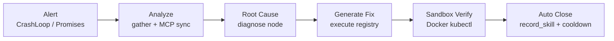

# Alert Closed Loop

From cluster signal to validated remediation (W7: **查 / 判 / 试 / 记 / 触**).



## Entry points

| Source | Path | Status |
|--------|------|--------|
| Cron patrol | `sentinel-inspect-patrol.sh` → `run_patrol()` | Live |
| Manual inspect | `trigger_inspect()` | Live |
| POST `/v1/inspect` | `apps/api/src/routes/inspect.py` | Live |
| Alertmanager webhook | `apps/api/src/routes/webhooks.py` | Code complete; live pending |

## Graph pipeline

Actual node order in [`graph.py`](../../agents/langgraph-server/src/graph.py):

```text
ingest → gather → diagnose → retrieve_skills → narrate
  → execute → sandbox_run → verify_skill → record_skill → query
```

- **Analyze**: `gather` pulls pod/events/metrics from LangGraph thread state
- **Root cause**: rule-based `diagnose` (+ optional LLM narrative)
- **Fix**: `execute` uses action registry (`restart_pod`, etc.) — default **dry_run**
- **Sandbox verify**: `sandbox_run` runs whitelisted kubectl in Docker (`sentinel-sandbox` ns only)
- **Auto close**: patrol cooldown + skill fingerprint dedup; production write gated behind W8+

## References

- [DEPLOY-ALERT-INSPECT.md](../deploy/DEPLOY-ALERT-INSPECT.md)
- [Weekly W26](../weekly/2026-W26.md) — patrol live evidence
