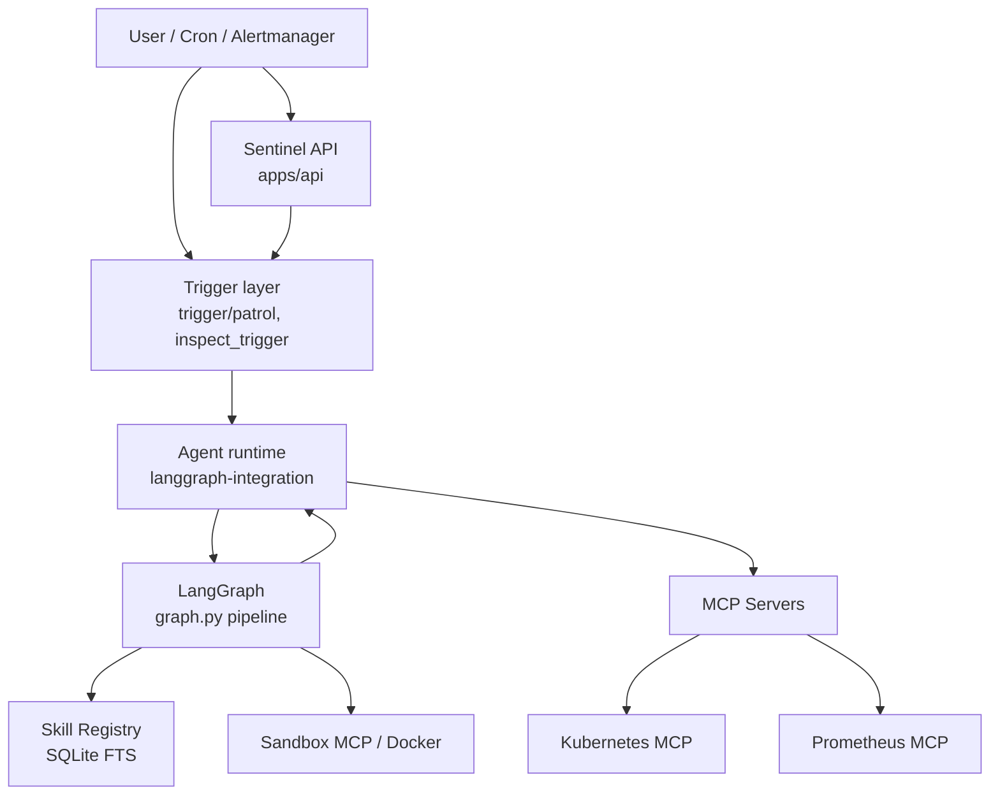

# System Overview

High-level data and control flow for Sentinel-X.

## Layers

| Layer | Role | Key paths |
|-------|------|-----------|
| **Entry** | HTTP inspect, Alertmanager webhook, cron patrol | `apps/api/`, `deploy/sync/sentinel-inspect-patrol.sh` |
| **Trigger** | Normalize alerts → `trigger_inspect` | `agents/langgraph-integration/src/trigger/` |
| **Runtime** | Sync K8s/Prom into graph thread; query helpers | `agents/langgraph-integration/src/sync/`, `query/` |
| **Graph** | ingest → gather → diagnose → … → record → query | `agents/langgraph-server/src/graph.py` |
| **Skills** | Retrieve and record runbooks (W5) | `skills/`, `src/skills/` |
| **MCP** | Standard tool boundary to cluster APIs | `mcp-servers/` |

## Deep dive

- Internal review: [Architecture Review v3](../ARCHITECTURE-REVIEW.md)
- Deploy topology: [DEPLOY-ONE-SHOT.md](../deploy/DEPLOY-ONE-SHOT.md)
