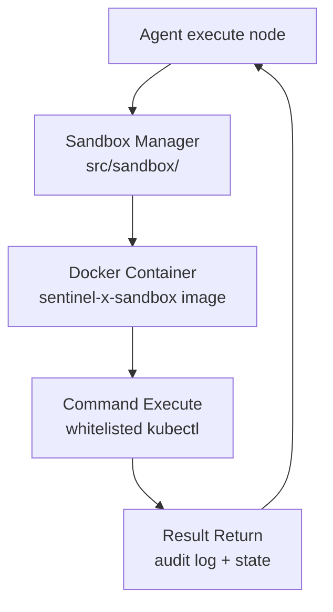

# Sandbox Execution

Isolated pre-run before any production kubectl write (W6).

## Safety model

| Mode | Behavior |
|------|----------|
| `dry_run=true` (default) | Simulate actions; no K8s API writes |
| Sandbox (`dry_run=false`) | Real kubectl **only** in `sentinel-sandbox` namespace |
| Production live | `SENTINEL_EXECUTE_LIVE=1` — **not implemented** (W8+) |

## Components

| Piece | Location |
|-------|----------|
| Sandbox image | `sandbox/Dockerfile`, `sentinel-x-sandbox:latest` |
| Executor | `agents/langgraph-integration/src/sandbox/` |
| Graph node | `sandbox_run` in `graph.py` |
| Verify script | `deploy/verify/verify-sentinel-x.sh --full` runs `sandbox_demo.py` |

## Why not host kubectl?

See [ADR-003: Why Docker Sandbox](../adr/003-why-docker-sandbox.md).
